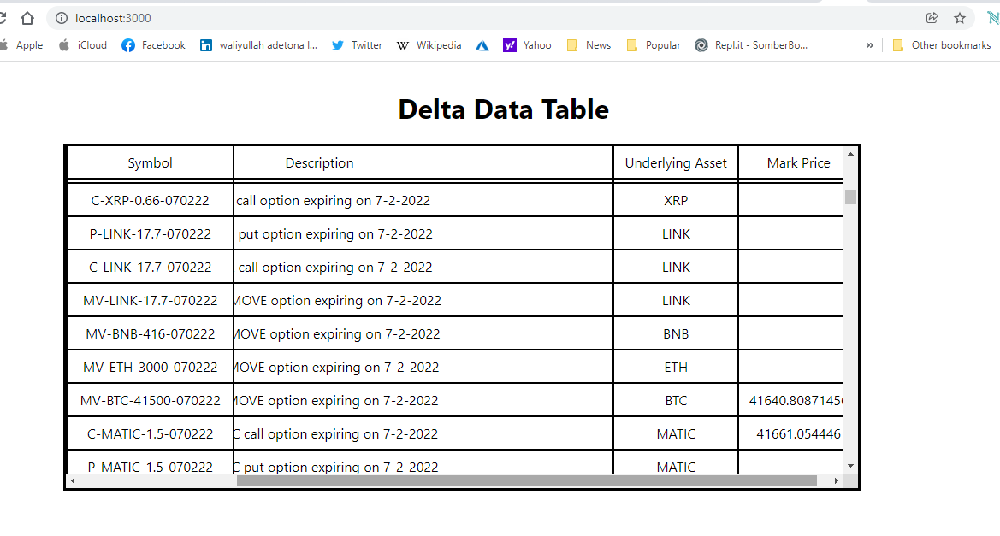

  <h2 align="center">Data Table </h2>
  
Use the API to fetch the initial data required. To can get only the columns from this API 
These are the field  respectively symbol, description, underlying_asset.symbol,Mark Price 

 

<!-- TABLE OF CONTENTS -->
## Table of Contents

* [Installation](#installation)
* [Built With](#built-with)
* [Contact](#authors)

<!-- INSTALLATION -->

## Installation

To run the app locally, clone the repository, navigate to it's directory.

#### Follow these commands step by step:-

git clone `https://github.com/taiwo2/Data-Table.git` 

cd main  

npm install  

npm start  

Now go to [localhost:3000](http://localhost:3000) in your browser.

<!-- BUILD WITH -->

## Built With

- HTML/CSS
- Reacts
- Axios
- Eslint
- ES6
- NPM

## Authors
👤 Taiwo Adetona

- Github: [@taiwo2](https://github.com/taiwo2)

- LinkedIn: [Taiwo Adetona](https://www.linkedin.com/in/taiwo-adetona/)

- Twitter: [@TaiwoAdetona4](https://twitter.com/TaiwoAdetona4/)

<!-- acknowledgments -->

## 🤝 Contributing

Contributions, issues and feature requests are welcome!

Feel free to check the [issues page](issues/).

## Show your support

Give a ⭐️ if you like this project!

## 📝 License

This project is [MIT](https://opensource.org/licenses/MIT) licensed.
